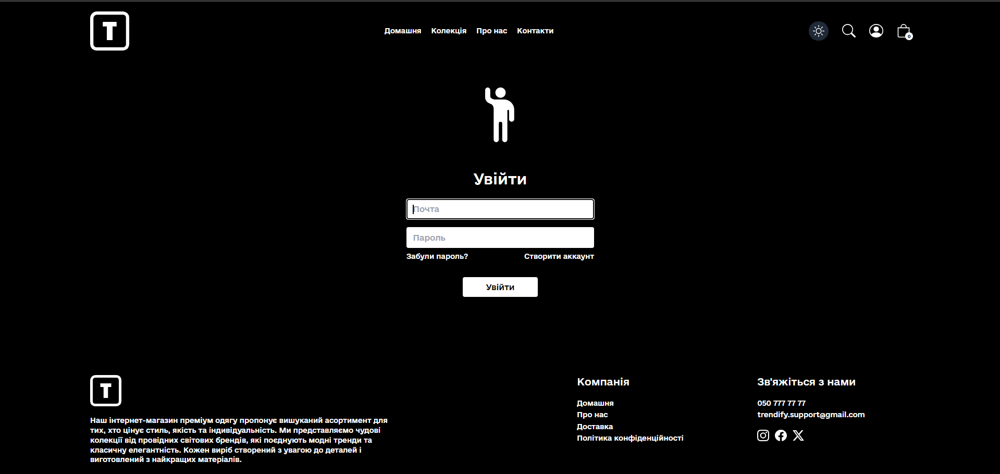

# Лабораторна робота №1: Вибір ідеї

## Команда "Марковські котики"

**Шульга Кирил** та **Петренко Андрій**, група ІО-24.

- **Шульга Кирил**: відповідає за фронт-енд частину.
- **Петренко Андрій**: відповідає за бек-енд частину.

## Ідея проекту

Ідеєю є e-commerce проект для магазину одягу. Обрана назва — **Trendify**.

## Репозиторій

[GitHub репозиторій](https://github.com/ksssks/project_kyryl_and_andrew)

## Опис проекту

Наш проект — це багатофункціональний e-commerce сайт, розроблений із урахуванням сучасних тенденцій веб-розробки та
максимальної зручності для користувачів. Сайт має світлу і темну тему, адаптивний інтерфейс і є повністю пристосованим
до роботи на різних пристроях: від смартфонів до великих екранів.

### Особливості сайту

#### Головна сторінка

- **Розділ "Остання колекція"** — демонструє найновіші надходження з нашого асортименту.
- **Розділ "Найчастіше купують"** — включає найбільш популярні товари серед покупців.
- **Три основні переваги** — виділені ключові плюси нашого магазину, що гарантують високу якість обслуговування.

#### Каталог товарів

- Повна колекція з можливістю:
    - Фільтрування за статтю, типом товару, наявністю знижки.
    - Сортування за релевантністю та ціною.
    - Пошуку за назвою для швидкого знаходження потрібного товару.
    - Пагінації для зручного перегляду великого каталогу.
- Спеціальні пропозиції та товари зі знижками.

#### Розділи "Про нас" та "Контакти"

- **Про нас**: історія бренду, наша місія та цінності.
- **Контакти**: зручна форма зворотного зв’язку та інформація для клієнтів.

#### Детальний опис товару

- Фотографії високої якості для кожного товару.
- Інформація про доступні розміри.
- Розмірна сітка, щоб клієнт міг легко підібрати потрібний розмір.

#### Кошик і оформлення замовлення

- Додавання товарів до кошика з можливістю редагування.
- Деталі доставки з вибором зручного способу.
- Оплата через **Stripe** — безпечна та швидка транзакція.

#### Адміністративна панель

- Можливість додавання, редагування та видалення товарів.
- База даних товарів із пошуком за артикулом.
- Перегляд замовлень для ефективного управління продажами.

#### Темна тема

- Темна тема реалізована для зручності користувачів у будь-який час доби.
- Зміна теми працює миттєво та не впливає на функціонал сайту.

### Технології

- **Vite React** — для швидкої розробки інтерфейсу.
- **Tailwind CSS** — для гнучкого та адаптивного стилізування.
- **MongoDB** — як надійна база даних.

### Адаптивність інтерфейсу

- Весь сайт створений із застосуванням передових технологій адаптивного дизайну, що забезпечує ідеальний вигляд та
  функціонал на будь-якому екрані — від смартфонів до планшетів і настільних ПК.

## Висновок

Наш проект спрямований на створення сучасного, швидкого та інтуїтивно зрозумілого інтернет-магазину, який відповідає
потребам як клієнтів, так і адміністраторів.

# Лабораторна робота №2 Налаштування проекту та інструментів розробки

### Кроки виконання:

1. **Створити пакети**
    - Було створено порожній проект за допомогою шаблону `vite + react`. Для цього було використано команду:
      ```bash
      npm create vite@latest my-project --template react
      ```
    - Налаштовано залежності та ініціалізовано проект.

2. **Налаштувати Tailwind CSS**
    - Додано Tailwind CSS відповідно до офіційної документації:
        - Встановлено залежності Tailwind CSS:
          ```bash
          npm install -D tailwindcss postcss autoprefixer
          npx tailwindcss init
          ```
        - Налаштовано файл `tailwind.config.js`.
        - Додано необхідні стилі до файлу `src/index.css`:
          ```css
          @tailwind base;
          @tailwind components;
          @tailwind utilities;
          ```

3. **Підключення раціонального шаблону створення компонентів (rafce)**
    - Для швидкого створення структури компонентів використовується `rafce` (React Arrow Function Component Export).

4. **Запуск фронтенд-сервера**
    - Сервер запущено за допомогою команди:
      ```bash
      npm run dev
      ```
    - Перевірено працездатність усіх модулів.

5. **Лінтер**
    - Використовується статичний лінтер, вбудований у PHPStorm.

6. **Організація структури проекту**
    - Проект поділено на кілька папок:
        - `components` — для компонентів.
        - `pages` — для сторінок.
    - Налаштовано базовий роутинг.

7. **Git-коміт**
    - Основний коміт:
      [cb2aeeb4e2bdfeaf6cc9610949c2ceafdbca2e2e](https://github.com/ksssks/project_kyryl_and_andrew/commit/cb2aeeb4e2bdfeaf6cc9610949c2ceafdbca2e2e)

### Форматування та налаштування:

- **Вибір стилю коду**
    - Використовується стандартний стиль React.

- **Форматування**
    - Інструмент форматування інтегровано в IDE (PHPStorm).

- **Лінтер/Статичний аналізатор**
    - Налаштований вбудований лінтер у PHPStorm для перевірки якості коду.

- **Git-hooks**
    - Налаштовано Git-hook на комміт та пуш для перевірки:
        - Форматування.
        - Лінтера.
        - Тестів (поки що використовуються завжди успішні команди).
        - Збірки/компіляції проекту.

### Результати

- Успішно налаштовано базове середовище для розробки.
- Організовано структуру проекту.
- Перевірено роботу всіх встановлених модулів та інструментів.
- Проект готовий до подальшої розробки.

# Лабораторна робота № 3 Розробка структури застосунку

## Діаграма компонентів ПЗ


## ER діаграма даних та їх зв’язків


## Опис оновлення, зміни та агрегації даних у додатку e-commerce

### Ключові сценарії роботи додатку

1. **Реєстрація та авторизація користувачів**
    - **Дія**: Користувач створює обліковий запис або входить у систему.
    - **Оновлення даних**:
        - У MongoDB створюється новий документ у колекції `users` із даними користувача (email, hashed password, name).
        - При авторизації токен доступу генерується і зберігається у сховищі (`localStorage`).
    - **Агрегація даних**:
        - Звірка введених даних із записами в базі для підтвердження автентифікації.

2. **Додавання товару в кошик**
    - **Дія**: Користувач додає продукт у свій кошик.
    - **Оновлення даних**:
        - У MongoDB оновлюється список у даних користувача `cartData` із доданим продуктом(ID товару), його розміром,
          кількістю.
    - **Агрегація даних**:
        - Виконується запит на отримання деталей продуктів із колекції `products` для відображення вмісту кошика.

3. **Оформлення замовлення**
    - **Дія**: Користувач підтверджує покупку.
    - **Оновлення даних**:
        - Створюється новий документ у колекції `orders`, що містить:
            - ID користувача.
            - Список замовлених товарів.
            - Статус замовлення (наприклад, "очікує на обробку").
    - **Агрегація даних**:
        - Використовуються агреговані запити для підрахунку загальної суми замовлення (включаючи знижки та доставку).

4. **Фільтрація та пошук товарів**
    - **Дія**: Користувач вводить пошуковий запит або застосовує фільтри.
    - **Зміна даних**:
        - Ніяких змін у базі не відбувається, але застосовується динамічний фільтр на стороні клієнта.
    - **Агрегація даних**:
        - У MongoDB використовуються запити з фільтрами (наприклад, за категорією, ціною, рейтингом).
        - Результати сортуються та передаються на фронтенд.

5. **Система знижок **
    - **Дія**: Користувач купує товари зі знижкою.
    - **Оновлення даних**:
        - У MongoDB оновлюється поле знижки для відповідного замовлення у колекції `orders`.
    - **Агрегація даних**:
        - Застосовуються правила розрахунку знижок до загальної суми замовлення.


6. **Адміністрування продуктів**
    - **Дія**: Адміністратор додає, редагує або видаляє товари.
    - **Оновлення даних**:
        - Додавання нового товару в колекцію `products`.
        - Оновлення існуючих записів або їх видалення за запитом.

### Взаємодія фронтенду (React, Tailwind) із MongoDB через бекенд

1. **React**:
    - Компоненти (наприклад, кошик, форма авторизації) отримують або надсилають дані через API.
    - Tailwind забезпечує адаптивний інтерфейс для швидкої роботи користувача.

2. **MongoDB**:
    - Зберігає дані користувачів, товарів, замовлень, кошиків і відгуків.
    - Агрегаційні запити виконуються для швидкої роботи з великими обсягами даних.

# Лабораторна робота № 4 Імплементувати основні сценарії використовуючи статичні дані (Без підключення до БД)

## Опис

Було виконано майже усю реалізацію фронтенду. Дані про товар підключалися без використання бази даних через файл
`assets.js`. Приклад об'єкта товару:

```javascript
// Приклад одиниці жіночого одягу.
{
    _id: "sw000003",
        name
:
    "Жіночий светр",
        description
:
    "Светр 'Зоряне Сяйво'",
        price
:
    71200,
        image
:
    [w_sweater3, w_sweater3_1, w_sweater3_2, w_sweater3_3, w_sweater3_4],
        category
:
    "Women",
        subCategory
:
    "Sweaters",
        sizes
:
    ["S", "XL"],
        date
:
    15647462,
        bestseller
:
    true
}
,
// Приклад одиниці чоловічого одягу.
{
    _id: "t000002",
        name
:
    "Чоловіча футболка",
        description
:
    "Футболка с принтом 'Криптан'",
        price
:
    15700,
        image
:
    [tshirt2, tshirt2_1, tshirt2_2, tshirt2_3, tshirt2_4],
        category
:
    "Men",
        subCategory
:
    "T-Shirts",
        sizes
:
    ["S", "M"],
        date
:
    222222222,
        bestseller
:
    false
}
```

## Особливості реалізації

- Дані про товари зберігалися у файлі `assets.js`.
- Зображення товарів зберігалися у папці проєкту, а не у базі даних.
- Для виведення списку товарів було використано статичні компоненти.
- Впроваджено динамічне оновлення інтерфейсу на основі статичних даних.

## Використані технології

- HTML, Tailwind CSS для створення макету інтерфейсу.
- JavaScript для реалізації функціоналу відображення товарів.
- React для побудови компонентної архітектури.

## Результати

- Сформовано базовий інтерфейс для відображення списку товарів.
- Реалізовано взаємодію користувача з товарами (наприклад, перегляд детальної інформації).
- Дані підключено через статичний файл `assets.js` без використання бази даних.

## Посилання на коміт

[Коміт реалізації](https://github.com/ksssks/project_kyryl_and_andrew/commit/6ee6d4c2a352259eddc73ad6d0edee5d3b4c7ea2)

## Подальші кроки

- Інтеграція бази даних Mongo DB для збереження та отримання інформації про товари.
- Розширення функціоналу (наприклад, додавання кошика, оформлення замовлення, реалізація панелі адміністратора).
- Оптимізація роботи із зображеннями (збереження в CDN або базі даних).

## Висновок

Лабораторна робота виконана успішно, основні завдання реалізовані. Сценарії використання були протестовані на статичних
даних.

# Лабораторна робота № 5 Імплементація інтеграції з віддаленими джерелами даних

Імплементація інтеграції з віддаленими джерелами даних.

## Опис

Було реалізовано інтеграцію з віддаленим сервером для отримання та відображення даних про товари. Всі запити до серверу
виконувались через API. Дані зберігалися у базі даних, а для взаємодії використовувався бекенд сервіс.

## Особливості реалізації

1. **Зберігання даних про товари**
   Усі товари в нашому інтернет-магазині зберігаються у колекції документів, що включають такі поля, як:
    - Назва товару (name)
    - Ціна (price)
    - Категорія (category)
    - Опис (description)
    - Зображення (images)
    - Розміри та доступність (sizes, stock)
    - Артикул (SKU)
    - Знижки (discount)

   Завдяки гнучкій структурі MongoDB ми можемо легко змінювати схему даних без потреби у складних міграціях, додаючи
   нові атрибути або модифікуючи існуючі. MongoDB — це NoSQL база даних, яка зберігає дані у форматі документів
   JSON-подібного типу (BSON). Вона чудово підходить для проєктів електронної комерції завдяки своїй гнучкості,
   масштабованості та високій продуктивності.

2. **Фільтрація та пошук**
   MongoDB забезпечує ефективну фільтрацію та пошук за різними критеріями, такими як:
    - Фільтрація за категоріями (наприклад, за типом товару чи статтю)
    - Пошук за назвою або артикулом
    - Сортування за ціною або релевантністю
    - Фільтрація за наявністю знижок

   Завдяки індексам MongoDB, ці запити виконуються швидко, навіть якщо база даних містить тисячі або мільйони записів.

3. **Управління користувачами**
   Усі дані про користувачів також зберігаються у MongoDB, включаючи:
    - Ім'я користувача
    - Електронну пошту
    - Паролі (захищені хешуванням)
    - Історію покупок
    - Список бажань
    - Адреси доставки

   Завдяки цій структурі ми можемо легко реалізувати функціонал реєстрації, входу та персоналізованого досвіду для
   кожного користувача.

4. **Збереження замовлень**
   Для кожного замовлення створюється окремий документ, що включає:
    - Деталі товарів у кошику
    - Дату та час замовлення
    - Статус замовлення (обробляється, доставлено, скасовано)
    - Деталі оплати (Stripe)
    - Адресу доставки

   Завдяки цьому адмін-панель може відображати актуальний стан усіх замовлень, а користувачі можуть відстежувати історію
   своїх покупок.

5. **Адміністративна панель**
   Адмін-панель дозволяє адміністраторам керувати товарами:
    - Додавати нові товари
    - Оновлювати інформацію про товари (ціна, опис, наявність)
    - Видаляти товари
    - Переглядати та фільтрувати замовлення

   Пошук товарів за артикулом (SKU) забезпечує швидкий доступ до конкретних позицій у базі.

## Особливості реалізації

- Отримання даних через API запити (за допомогою `axios`).
- Відображення списку товарів на основі отриманих даних.
- Динамічне оновлення інтерфейсу в реальному часі на основі відповіді сервера.
- Інтеграція з базою даних для збереження даних про товари.

## Використані технології

- MongoDB для збереження даних.

## Посилання на коміт

[Коміт реалізації](https://github.com/ksssks/project_kyryl_and_andrew/commit/5fd55606538c46ed8033d343e6fbd6db709945ff)

## Фрагмент під'єднання фронд енд частини до бек енд

```javascript
const ShopContextProvider = (props) => {

    const currency = '₴';
    const delivery_fee = 150;
    const backendUrl = import.meta.env.VITE_BACKEND_URL
    const [search, setSearch] = useState('');
    const [showSearch, setShowSearch] = useState(false);
    const [cartItems, setCartItems] = useState({});
    const [products, setProducts] = useState([]);
    const [token, setToken] = useState('');
    const navigate = useNavigate();

    const addToCart = async (itemId, size) => {
        let cartData = structuredClone(cartItems);


        if (!size) {
            toast.error('Оберіть розмір')
            return;
        }

        if (cartData[itemId]) {
            if (cartData[itemId][size]) {
                cartData[itemId][size] += 1;
            } else {
                cartData[itemId][size] = 1;
            }
        } else {
            cartData[itemId] = {};
            cartData[itemId][size] = 1;
        }
        setCartItems(cartData);

        if (token) {
            try {

                await axios.post(backendUrl + '/api/cart/add', {itemId, size}, {headers: {token}})

            } catch (error) {
                console.log(error);
                toast.error(error.message)
            }
        }

    }
}
```

## Скриншоти бази даних


## Висновок

Лабораторна робота виконана успішно. Реалізована інтеграція з віддаленими джерелами даних, а також протестована робота
API та бази даних.

# Лабораторна робота № 6: Тестування програмного забезпечення

## Мета роботи

- Покрити модулі системи тестами різного рівня: UNIT, інтеграційні, E2E.
- Провести мутаційне тестування та оцінити ефективність тестів.

## Завдання

### 1. UNIT-тестування

- Повністю покрити один із модулів системи UNIT-тестами.
- Забезпечити перевірку всіх функцій та методів модуля.
- Переконатися, що модуль працює коректно в ізольованому середовищі.
  
  
  

### 2. Інтеграційне тестування

- Налаштувати інтеграційні тести, які включають:
    - Підключення до бази даних.
      
    - Запуск HTTP сервера.
      
      
    - Тестування взаємодії між залежними модулями.
      
      
      
      
      
      

### 3. E2E тестування

- Налаштувати End-to-End тестування, яке охоплює:
    - Перевірку всіх елементів системи.
    - Симуляцію повного робочого циклу програми.
- Забезпечити перевірку взаємодії між компонентами з точки зору кінцевого користувача.

#### Повний цикл

- Панель адміністратора:
    - Реєстрація
      
    - Усі товари
          -
    - Фільтрація за артикулом
      
    - Видалення товару
      
    - Зміна товару
      
      
      
    - Додавання нового товару
      
      
      
    - Замовлення
      
    - Біла тема та пагінація
      
- Користувацький інтерфейс:
    - Остання колекція
      
    - Найчастіше купують
      
    - Три плюси, поле для розслилання, футер
      
    - Усі колекції
      
    - Ціна за зростанням
      
    - Ціна за спаданням
      
    - Фільтри чоловічий одяг та футболки і реглани
      
    - Фільтри жіночий одяг та брюки та джинси
      
    - Фільтри по знижці
      
    - Пошук та пагінація
      
    - Про нас та біла тема
      
      
    - Контакти
      
    - Увійти
      
    - Зареєструватися та строгий пароль
      
    - Картка товару
      
    - Розмірні сітки: чоловіча та жіноча
      
    - Товари у корзині та загальна сума
      
    - Видалення товару з корзини та додавання нового
      
    - Подробиці замовлення та спосіб оплати
      
    - Мої замовлення
      
      
      
    - Телефонна версія та версія для планшету
      
      
      
    - Оплата Stripe

### 4. Мутаційне тестування

- Покриття коду тестами
- **Unit-тестування**:
    - Покрито: **40% функцій**.
    - **Висновок**: Недостатній рівень покриття для забезпечення стабільності та надійності коду. Необхідно покращити.

- **Інтеграційне тестування**:
    - Покриття: **100% запусків**.
    - **Висновок**: Тести охоплюють взаємодії між компонентами, але слід перевірити якість сценаріїв.

- **Е2Е тестування**:
    - Покриття: **~90% функціоналу**.
    - **Висновок**: Високий рівень покриття, але слід перевірити реальні сценарії використання та знайти можливі
      пропущені кейси.

- Ефективність виявлення помилок
- **Ефективність тестів**: Виявлено ключові дефекти в інтеграційних та E2E тестах.
- **Проблеми**:
    - Брак покриття критичних модулів Unit-тестами.
    - Деякі помилки залишаються непоміченими на ранніх етапах.

- Що потрібно покращити

1. **Unit-тестування**:
    - Покрити всі функції Unit-тестами для більш глибокої перевірки бізнес-логіки.
    - Забезпечити якість тестів, що перевіряють ключові граничні випадки.

2. **Масштабне тестування**:
    - Запустити проєкт у масовому режимі з великою кількістю інтеграційних тестів, щоб виявити можливі приховані
      дефекти.

3. **Е2Е тестування**:
    - Розширити сценарії, щоб охопити специфічні реальні кейси.
    - Перевірити критичні шляхи, що використовуються найчастіше.

- Наступні кроки
    - Підвищити покриття Unit-тестами до **70-80%**.
    - Перевірити якість інтеграційних тестів, додати нові сценарії.
    - Регулярно проводити мутаційне тестування для оцінки якості тестів.
    - Створити автоматичні звіти для аналізу ефективності тестування.

# Лабораторна робота № 7: Розгортання програмного забезпечення

## Що реалізовано:

1. **Перевірка стилю коду**:
    - Використано **Prettier** для перевірки стилю коду.
    - Автоматична перевірка виконується при кожному створенні Pull Request (PR) або новому коміті.

2. **Аналіз коду на помилки**:
    - Налаштовано **ESLint** для перевірки JavaScript коду.
    - Забезпечується перевірка на відповідність кращим практикам та виявлення потенційних помилок.

3. **Перевірка збірки**:
    - Налаштовано автоматичну перевірку того, що проект успішно збирається (build).

4. **Тести**:
    - Додано стаб-тести, які завжди проходять успішно, для перевірки роботи тестової системи. У майбутньому буде додано
      повноцінні тести.

5. **Перевірка стилю комітів**:
    - Використано стандарт **Conventional Commits** для опису комітів.
    - Автоматично перевіряється, чи відповідають повідомлення комітів обраному стилю.

6. **Інтеграція з GitHub**:
    - **GitHub Actions** використовується для налаштування CI/CD.
    - Під час створення Pull Request або коміту автоматично виконуються всі перевірки:
        - Форматування (Prettier).
        - Лінтинг (ESLint).
        - Успішність збірки.
        - Тестування.
        - Відповідність комітів Conventional Commits.
    - Можливість змерджити PR доступна лише у випадку успішного проходження всіх перевірок.

7. **Файл `GitHub Actions`**:
    - В корені проекту створено файл `.github/workflows/ci.yml` із наступними перевірками:
        - **Lint**: Запускається ESLint для перевірки якості коду.
        - **Format**: Запускається Prettier для перевірки стилю.
        - **Build**: Перевіряється, чи проект успішно збирається.
        - **Test**: Запускаються стабільні тести.
        - **Commitlint**: Перевіряється стиль комітів.

8. **Обмеження на GitHub**:
    - У налаштуваннях репозиторію ввімкнено **Branch Protection Rules**:
        - PR не можна змерджити, якщо одна з перевірок CI не пройшла.
        - Вимога принаймні одного успішного review перед злиттям.
    - Усі зміни в гілці `main` проходять через Pull Request.

# Лабораторна робота № 8: Перформанс

- Аналіз проекту за допомогою https://developers.google.com/web/tools/lighthouse/,
    - Головна сторінка    
      
    - Колекції
      
    - Сторінка продукту
      
    - Головна(телефонна версія)
      
    - Колекції(телефонна версія)
      
    - Сторінка продукту(телефонна версія)
      
    - Тестування в панелі адміністратора було проведено, але не має великого сенсу через невелику кількість навантаження
      на сервер сайту з боку панелі адміна.
- Тест навантаження вашої системи який виконуватиме ті сценарії використання що покривають всі елементи
  системи та є найбільш типовими для звичайної роботи сервісу.
    - Запуск сервер с профайлером та запуск тесту навантаження та збір даних був виконаний за допомогою інструменту
      Artillery.
        - Artillery — це потужний інструмент для тестування навантаження, який дозволяє перевіряти продуктивність і
          масштабованість веб-додатків і API.
        - Він є простим у використанні, підтримує високу гнучкість і дозволяє виконувати комплексні тести навантаження.

    - Основні характеристики Artillery:
        - Легка конфігурація: Тести налаштовуються за допомогою YAML-конфігурацій, що дозволяє швидко створювати та
          запускати сценарії.
        - Підтримка HTTP та WebSocket: Artillery підтримує тестування як HTTP, так і WebSocket-з'єднань, що робить його
          підходящим для тестування різних типів сервісів.
        - Розширюваність: Завдяки модульній архітектурі можна додавати плагіни та інтегрувати інструмент з іншими
          системами для збору результатів або аналітики.
        - Паралельне виконання: Artillery може імітувати тисячі користувачів, що дозволяє проводити масштабовані
          навантажувальні тести.
        - Збір статистики: Під час виконання тестів збирається детальна статистика про запити, час відповіді, кількість
          помилок тощо.
          
- Проаналізувати репорт.
    - HTTP 200 responses: 2299 успішних запитів (усі відповіді були успішними).
    - Завантажено байт: 11,211,586 байтів, що вказує на значний обсяг даних.
    - Запитів на секунду: 42 запити/сек, що свідчить про досить високе навантаження.
    - Час відповіді:
        - Мінімальний час відповіді: 1 мс
        - Максимальний час відповіді: 4803 мс
        - Середній час відповіді: 150.4 мс
        - 95-й процентиль: 854.2 мс
        - 99-й процентиль: 1686.1 мс
    - Сеанси користувачів:
        - Завершено сеансів: 1200
        - Максимальна тривалість сеансу: 5665.8 секунд
        - Середня тривалість сеансу: 292.4 секунди
        - 95-й процентиль тривалості сеансу: 1353.1 секунди
    - Висновок:
        - Продуктивність: Сервер витримав хорошу кількість запитів без помилок, із стабільним часом відповіді.
        - Безпека
- Аналіз запитів до БД вбудованими інструментами.
  
    - Результати тестування навантаження MongoDB

        - Після проведення тестування навантаження бази даних було отримано наступні результати:

        - Загальна інформація
            - **Тип бази даних**: MongoDB (кластер з трьома шардовими вузлами)
    - **URL шардових вузлів**:
        - `cluster0-shard-00-00.ffanr.mongodb.net:27017`
        - `cluster0-shard-00-01.ffanr.mongodb.net:27017`
        - `cluster0-shard-00-02.ffanr.mongodb.net:27017`

    - Результати
      -
            1. **Opcounters (операції бази даних)**

            - **Шард-00-00**: Активність майже відсутня (0-5 операцій/с).
            - **Шард-00-01**: Подібно до першого вузла, активність низька (0-5 операцій/с).
            - **Шард-00-02**: Значна активність, пікові значення операцій запису (`insert`) досягали 15 операцій/с. Це
              вказує на нерівномірний розподіл навантаження.

        -
            2. **Connections (активні з'єднання)**

            - **Шард-00-00**: Стабільно низька кількість активних з'єднань.
            - **Шард-00-01**: Подібно до шард-00-00, мінімальна кількість з'єднань.
            - **Шард-00-02**: Динамічні зміни в кількості з'єднань (до 40). Цей вузол обробляв більшість підключень
              клієнтів.

        -
            3. **Network (мережеве навантаження)**

            - **Шард-00-00 та Шард-00-01**: Мінімальне мережеве навантаження (~0-49 КБ/с).
            - **Шард-00-02**: Максимальне мережеве навантаження, з піковими значеннями до 144 КБ/с. Це свідчить про
              значний обсяг операцій вводу/виводу.

    - Висновки
      -
        1. **Нерівномірне навантаження на шардовий кластер**:
            - Основне навантаження припадає на вузол `cluster0-shard-00-02`, що може бути наслідком некоректного
              розподілу даних між шардовими вузлами.
            - Необхідно переглянути стратегію шардування (`shard key`) для забезпечення рівномірного навантаження.

    -
        2. **Оптимізація мережевого навантаження**:
            - Перші два вузли недовантажені, тоді як третій вузол обробляє великий обсяг операцій. Це може призвести
              до зниження продуктивності кластера в умовах реального використання.

    -
        3. **Рекомендації**:
            - Провести аналіз вибору `shard key` для оптимального розподілу даних між вузлами.
            - Налаштувати балансування запитів для рівномірного розподілу операцій між усіма вузлами кластера.
            - Виконати додаткові тести навантаження після внесення змін до конфігурації.

# Лабораторна робота №9 Виправляємо ботлнеки і вчимося виносити код з проекту

### Мета

Навчитися ідентифікувати вузькі місця (botllenecks) у системі, рефакторити код і переносити модулі в окремі бібліотеки
для покращення масштабованості та підтримки проекту.

---

### **Аналіз системи**

#### **Тестування та навантаження**

За результатами тестування система працює стабільно, вузьких місць при поточному навантаженні не виявлено. Ключові
аспекти:

1. **Підгрузка даних із Cloudinary**
    - Дані швидко підвантажуються з хмари.
    - Знижено навантаження на базу даних, оскільки основна інформація зберігається у хмарному сховищі.
    - Дані займають мінімум місця у БД, що оптимізує роботу сервера.

2. **Інтерфейс**
    - Інтерфейс добре структурований і не перевантажений стилями.
    - Відсутні накладання CSS або складнощі, що впливають на продуктивність.

3. **Модулі системи**
    - Модуль, який потребував би значного абстрагування чи перенесення в окрему бібліотеку, відсутній.
    - Загальний дизайн системи не створює перешкод для її розширення чи масштабування.

### **Висновки та пропозиції**

- Наразі система не має значних проблем у продуктивності або дизайні.
- У рамках даної роботи рекомендується провести формалізацію існуючих компонентів, створивши невеликий приклад окремої
  бібліотеки, навіть якщо її необхідність не критична. Це дозволить відпрацювати практичні навички перенесення та
  абстрагування коду.

### **Рефакторинг і створення бібліотеки**

Для демонстрації процесу можна:

1. Виділити умовний модуль, наприклад, для роботи з Cloudinary API.
2. Реалізувати його у вигляді окремої TypeScript-бібліотеки.
    - **Інтерфейс**: передача ключів та конфігурації для роботи з Cloudinary як залежностей.
    - **Методи**: підвантаження, видалення, оновлення даних із хмарного сховища.
3. Підключити цю бібліотеку у проект через імпорт.

### **Рекомендації для наступних етапів**

- Використовувати TypeScript для уніфікації типів і підвищення надійності коду.
- Регулярно проводити аналіз продуктивності та навантаження для запобігання потенційним вузьким місцям.
- У разі зростання системи абстрагувати нові модулі для збереження структурованості проекту.

